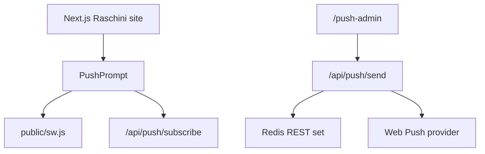
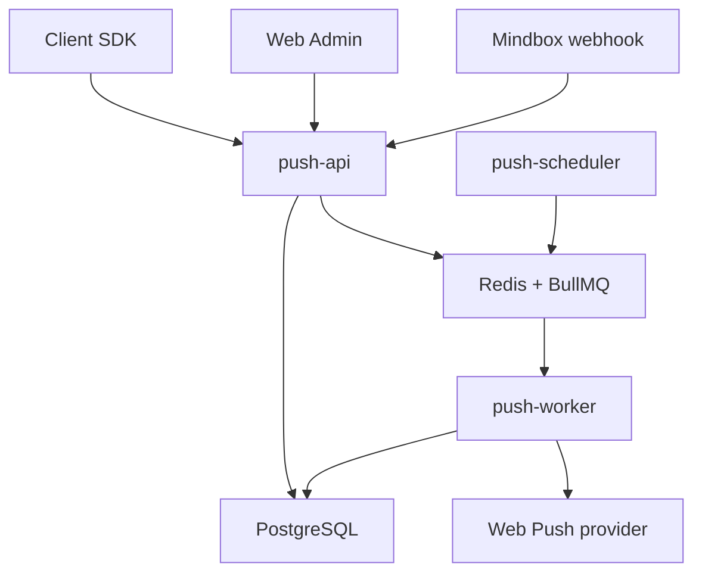

# Architecture

## Product Thesis

Saas Push Giant is not just a push sender. It is a fast PWA packaging layer for businesses that already have a website but do not have time or budget for a native app.

Version 1 must focus on a reliable push core, tenant isolation, portable deployment, and low-friction website integration. Mobile landing pages and CRM automation are prepared architecturally but do not block the MVP.

## Current State

The imported Raschini prototype is a single Next.js application:



This is acceptable as a prototype, but it is not the commercial architecture because delivery depends on a web request, tenant data is not modeled, campaign state is not durable, and storage is a single Redis set.

## Target State



## Target Repository Layout

```text
apps/
  admin/                # Web admin UI
  api/                  # Node.js TypeScript API
  scheduler/            # Scheduled campaign dispatcher
  worker/               # Push delivery worker
packages/
  sdk/                  # Browser SDK and service worker template
  shared/               # Shared types, validation, constants
  database/             # Migrations, seeds, data access helpers
plugins/
  wordpress/            # WordPress plugin ZIP source
  bitrix/               # Bitrix module source
docs/
  api/                  # OpenAPI and endpoint notes
  integrations/         # Mindbox and future CRM/CDP docs
  migration/            # Tenant migration plans
deploy/
  docker/               # Dockerfiles, Caddy/Nginx, scripts
```

## Core Services

| Service | Responsibility |
| --- | --- |
| `push-api` | Auth, tenants, subscriptions, campaigns, uploads, integrations, OpenAPI |
| `push-worker` | Batch delivery, retries, endpoint cleanup, stats |
| `push-scheduler` | Moves due scheduled campaigns to queue |
| `postgres` | Durable tenants, campaigns, subscriptions, events, audit log |
| `redis` | BullMQ queue, rate-limit counters, short-lived locks |
| `reverse-proxy` | TLS, routing, security headers, compression |

## Key Decisions

- PostgreSQL is the source of truth; Redis is queue/cache, not the database.
- Each subscription is identified by `endpoint_hash`, not by a raw JSON string.
- VAPID credentials are project-scoped.
- Push provider success means accepted, not displayed.
- Geo push in v1 means last known explicit location, not background geofencing.
- Mindbox is an integration option, not a core dependency.
- Raschini is a demo tenant/theme and migration reference.

## Open Questions

- Final admin frontend stack: keep Next.js in `apps/admin` or use a lighter Vite app.
- API framework: Fastify is the current recommendation for typed API, performance, plugins, and OpenAPI.
- Object storage provider for images: S3-compatible storage is preferred for portability.
- Russian personal-data hosting: use our Russian VPS for Russian clients by default; on-premise remains a paid tier.
