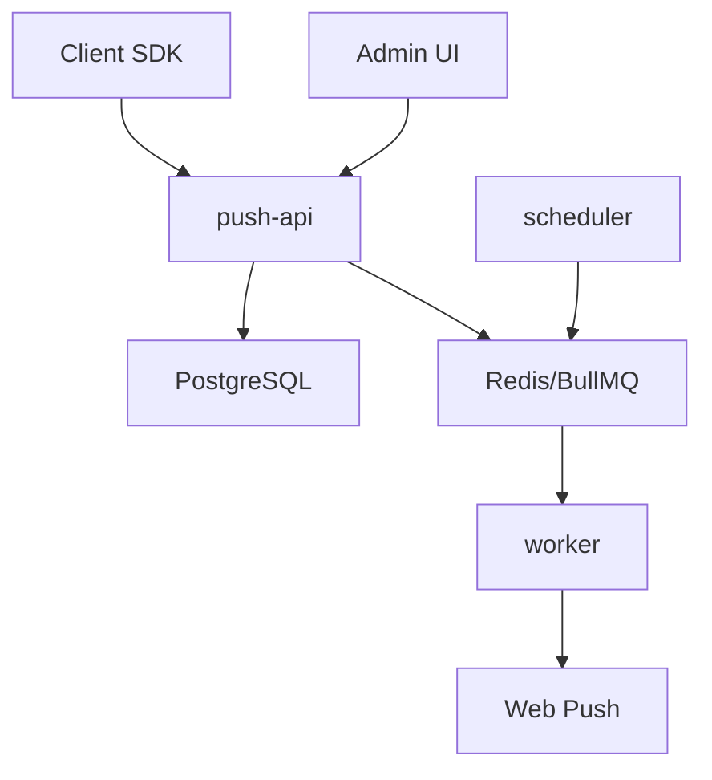

# First Result: Stage 0 Audit and Bootstrap

## 1. Transfer Confirmation

The Raschini prototype code has been imported locally into the Saas Push Giant working tree.

- Product remote: `https://github.com/mrreduck-lab/Saas-Push-Giant.git`
- Prototype remote: `https://github.com/mrreduck-lab/raschini-site.git`
- Baseline tag: `raschini-pwa-prototype`
- Baseline SHA: `7f435e0559dba0ecbd9183f4e9b83acd2cda7a6c`

Remote push still needs write authentication from this environment.

## 2. Build Result

Command:

```bash
NPM_CONFIG_CACHE=/tmp/npm-cache npm run build
```

Result: build passes.

Warning: `next@14.2.5` is deprecated and has a security advisory.

Additional checks:

- `npm audit --audit-level=moderate` fails with `critical` Next.js advisories and `high` PostCSS advisories. The suggested fix path is upgrading Next from `14.2.5` to a patched `14.2.x` release or newer.
- `npm run lint` is not a real check yet because `next lint` opens the interactive ESLint setup prompt. Add a committed ESLint config before treating lint as CI.

## 3. Current File and Function Map

| Path | Current role |
| --- | --- |
| `app/page.tsx` | Hardcoded Raschini landing page |
| `app/layout.tsx` | Raschini metadata, manifest, fonts, global PushPrompt |
| `app/components/PushPrompt.tsx` | Registers service worker and creates browser push subscription |
| `public/sw.js` | Shows notifications and opens target URL on click |
| `public/manifest.json` | Raschini PWA manifest |
| `app/api/push/public-key/route.ts` | Returns public VAPID key |
| `app/api/push/subscribe/route.ts` | Saves subscription JSON |
| `app/api/push/send/route.ts` | Sends push to every stored subscription |
| `app/api/push/debug/route.ts` | Protected server diagnostics |
| `app/debug-push/page.tsx` | Browser/server diagnostics UI |
| `app/push-admin/page.tsx` | Minimal protected push send UI |
| `lib/push-store.ts` | Redis REST subscription storage |
| `scripts/fetch-assets.mjs` | Asset download helper |
| `public/IMG_4803.png` | Raschini logo/media asset |
| Raschini hero video | Removed from the product repository; keep large brand media in tenant/demo asset storage, not in the SaaS core. |

## 4. What Works Now

- PWA manifest is present.
- Service worker registers.
- Push permission is requested after button click.
- Subscription can be saved to Redis REST storage.
- Admin can send a push to stored subscriptions.
- Push click opens or focuses the configured URL.
- Basic diagnostics exist.
- Invalid endpoints with `404`/`410` are removed.

## 5. Temporary Prototype Parts

- Raschini design is hardcoded.
- VAPID keys are global, not project-scoped.
- Subscriptions live in one Redis set.
- Sending happens inside an HTTP request.
- Admin auth is a single shared token.
- No campaign model, queue, scheduler, tenant isolation, roles, analytics, or durable retries.

## 6. Technical Debt

- Next.js version must be upgraded.
- ESLint is not configured; `npm run lint` is currently interactive.
- No `.gitignore` existed in the prototype.
- No lockfile was committed before dependency installation.
- Redis REST/Upstash dependency is too specific for portable SaaS/on-premise.
- Subscription identity uses full JSON string storage, not `endpoint_hash`.
- Raw endpoint prefix can appear in failure responses.
- No OpenAPI contract.
- No migration framework.
- No Docker deployment package.
- No unit/integration tests.

## 7. Proposed New Structure

See `ARCHITECTURE.md`.

## 8. Architecture Scheme



## 9. Data Model

See `docs/data-model.md`.

## 10. API Endpoints

See `docs/api/endpoints.md`.

## 11. Raschini Migration Without Downtime

See `docs/migration/raschini.md`.

## 12. Stage Estimates

See `docs/estimates.md`.

## 13. Risks and Disputed Decisions

- Full background geofence push is not honest for ordinary iOS PWA; sell last-known-location segmentation in v1.
- A shared SaaS platform is better for small clients; on-premise should be priced as a separate operational product.
- WordPress service worker scope can conflict with existing PWA plugins; diagnostics must detect this.
- Some platforms ignore push images or render them differently; admin copy must say this clearly.
- Migrating existing subscriptions may require users to refresh or re-subscribe if VAPID keys/domain scope change.

## 14. Reuse From Raschini Site

- PWA manifest/icon lessons.
- Service worker notification click behavior.
- Subscription flow with user-triggered permission request.
- Basic diagnostics ideas.
- Web push delivery handling for invalid endpoints.
- Raschini as first demo tenant.

## 15. Remove or Rewrite

- Hardcoded Raschini brand from product core.
- Redis set storage for subscriptions.
- In-request bulk delivery.
- Shared admin token.
- Direct dependency on Vercel/Upstash-style env names.
- Brand-specific push defaults.

## 16. Recommended Stack

- Node.js + TypeScript.
- Fastify for API and OpenAPI integration.
- PostgreSQL for durable source of truth.
- Redis + BullMQ for queue and jobs.
- Prisma or Drizzle for schema/migrations; recommendation: Drizzle for explicit SQL and portable migrations.
- Next.js or Vite admin; recommendation: keep Next.js only if SSR/auth benefits matter, otherwise Vite is leaner.
- S3-compatible object storage for campaign images/icons.
- Caddy or Nginx as reverse proxy.
