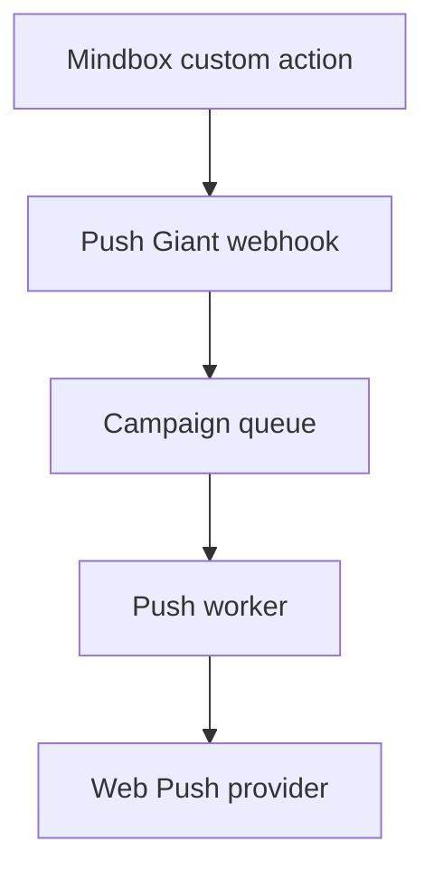

# Mindbox Integration Draft

Status: designed, not implemented. Do not claim production readiness until tested on a real Mindbox project.

## Mode A: Mindbox Triggers Push Giant

Mindbox calls a signed Push Giant webhook with customer identifiers, campaign content or template ID, and target project.

## Mode B: Push Giant Sends Events To Mindbox

Events:

- `pwa_installed`
- `push_permission_granted`
- `push_permission_denied`
- `subscribed`
- `unsubscribed`
- `notification_accepted`
- `notification_clicked`

Each event should include:

- `project_id`
- `campaign_id` when relevant
- `external_customer_id`
- `mindbox_customer_id`
- `anonymous_id`
- hashed email/phone when allowed

## Identity Mapping

Supported identifiers:

- `external_customer_id`
- `mindbox_customer_id`
- `email_hash`
- `phone_hash`
- `site_customer_id`
- `anonymous_browser_id`

## Webhook Authentication

Recommended:

- `X-PushGiant-Timestamp`
- `X-PushGiant-Signature`
- HMAC SHA-256 over timestamp + raw body
- replay protection by timestamp window

## Limitations

- Web Push accepted by provider does not guarantee display.
- iOS PWA push support depends on installation and platform version.
- Images are platform-dependent.
- Background geofence push is not promised for ordinary PWA.

## Personal Data

For Russian clients, keep personal data and identifier mapping on approved infrastructure. Avoid sending raw phone/email unless the client has a documented legal basis and integration settings allow it.
